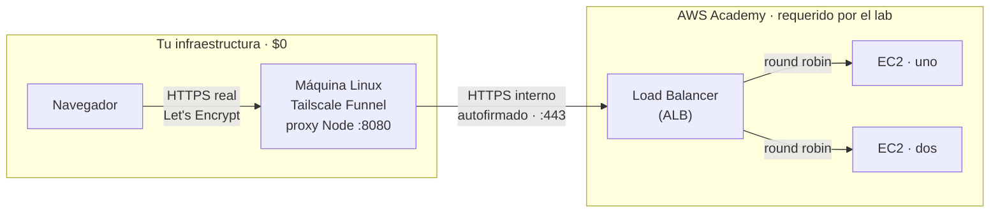

# AWS Load Balancing Lab

Laboratorio de **Sistemas Distribuidos** (Lab02): un Application Load Balancer de AWS distribuye el tráfico en round robin entre dos instancias EC2, con HTTPS confiable de punta a punta. Sin comprar un dominio y gastando la menor cantidad posible de créditos en AWS Academy.

Todo se despliega con Terraform. La parte de AWS es efímera (se crea y se destruye libremente); el frente HTTPS vive fuera de AWS, en una máquina personal siempre encendida, y se resincroniza solo en cada `terraform apply`.

## Arquitectura



**Por qué está partido así:** AWS Academy Learner Lab no deja crear CloudFront (`AccessDenied`) y no hay dominio propio para pedir un certificado validado por DNS. En vez de eso, [Tailscale Funnel](https://tailscale.com/kb/1223/funnel) [gratis] expone la máquina personal a internet con un certificado real de Let's Encrypt, y un pequeño proxy en Node.js reenvía cada petición al ALB. El Load Balancer y las dos EC2 sin agrega lógica.

## Qué hace cada pieza

| Pieza | Dónde vive | Qué hace |
|---|---|---|
| **ALB** (`aws_lb`) | AWS | Recibe el tráfico y lo reparte en round robin entre las 2 EC2. |
| **2× EC2** (`aws_instance.web`) | AWS | Corren una app Node.js (instalada vía `user_data.sh`) que responde con su propio Instance ID, IP y AZ — para ver el round robin en vivo. |
| **Target group + health check** | AWS | Marca una instancia como sana/enferma pegándole a `/health` cada 15s. |
| **Security Groups** | AWS | El ALB acepta 80/443 de todo internet; las EC2 solo aceptan HTTP del ALB y SSH de una IP fija. |
| **Cert self-signed + ACM** | AWS | HTTPS interno en el ALB — válido criptográficamente, pero sin autoridad pública (por eso el navegador lo marca "no seguro" si se visita directo). |
| **Tailscale Funnel** | Máquina personal | Expone un puerto local a internet con un certificado real de Let's Encrypt. |
| **Proxy Node** (`tailscale-edge-setup.sh`) | Máquina personal | ~30 líneas: recibe la petición de Funnel y la reenvía al ALB por HTTPS. Corre como servicio de usuario (`systemd --user`), sin necesitar root. |
| **`null_resource.edge_proxy_sync`** | Terraform | Cada vez que el ALB se recrea (nuevo DNS), se conecta por SSH a la máquina personal y actualiza el proxy automáticamente. |

## Estructura del repo

```
main.tf                  # ALB, EC2, Security Groups, cert self-signed, sync del edge
variables.tf              # Parámetros configurables (tamaño de instancia, CIDR de SSH, host del edge...)
outputs.tf                # URLs, IDs de instancia, comandos de SSH listos para copiar
providers.tf               # Configuración del provider de AWS
versions.tf                 # Versiones de providers + backend remoto (S3) del state
user_data.sh                 # Script que arranca en cada EC2: instala Node.js y levanta la app
tailscale-edge-setup.sh       # Bootstrap de una sola vez en la máquina personal (fuera de AWS)
```

## Cómo desplegarlo

Requisitos: una cuenta de AWS Academy Learner Lab, una cuenta de Tailscale (gratis), y una máquina Linux/macOS siempre encendida para el edge.

```bash
# 1. Credenciales de AWS Academy en ~/.aws/credentials, perfil [academy]

# 2. Bootstrap de una sola vez en la máquina del edge (ver tailscale-edge-setup.sh)

# 3. Desde esta carpeta, con tu llave SSH del edge desbloqueada en el agente:
ssh-add ~/.ssh/id_ed25519
terraform init
terraform apply
```

Al terminar, `terraform output alb_dns_name` te da el DNS del load balancer (con cert self-signed), y tu URL de Tailscale (`https://<tu-hostname>.<tu-tailnet>.ts.net`) te da el mismo contenido con HTTPS confiable — el `null_resource` ya sincronizó ambos.

Para verificar el round robin en vivo:

```bash
for i in $(seq 1 10); do curl -sk https://<alb-dns>/api/whoami; echo; done
```

## Trade-offs reconocidos

- La máquina personal que corre Tailscale Funnel es un punto único de falla **fuera** del SLA de AWS: si se apaga, el link público deja de responder aunque el ALB esté sano.
- Tailscale Funnel está pensado para uso personal/desarrollo, no para tráfico de producción a gran escala.
- `terraform apply` necesita que la llave SSH del edge esté desbloqueada a mano (`ssh-add`) — no corre 100% desatendido.

Para este laboratorio, con presupuesto $0 y sin dominio propio disponible, es una elección razonada. En un sistema de producción real, el certificado viviría directamente en el ALB con un dominio propio + ACM.

